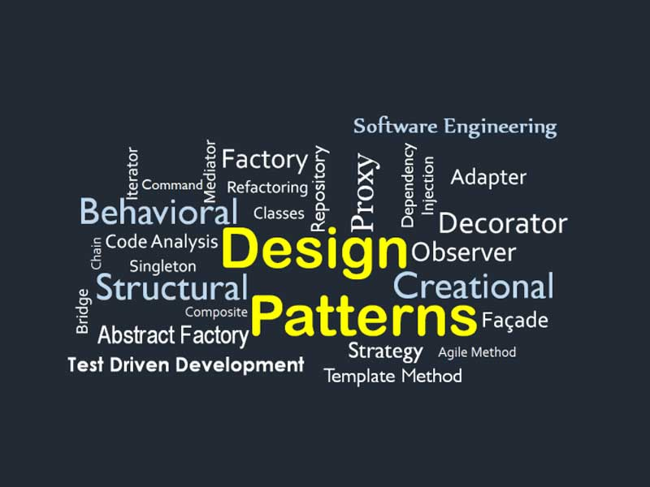

 
Design patterns, in terms of software engineering, are used to improve the usability and maintainability of software design, creating reusable solutions to recurring problems. I didn’t know this at first but I have been using design patterns throughout the current semester in my software engineering class. By understanding the different design patterns, I can truly admit that it has made developing software all the more easy. 

## My Thoughts on Design Patterns

## Summary

