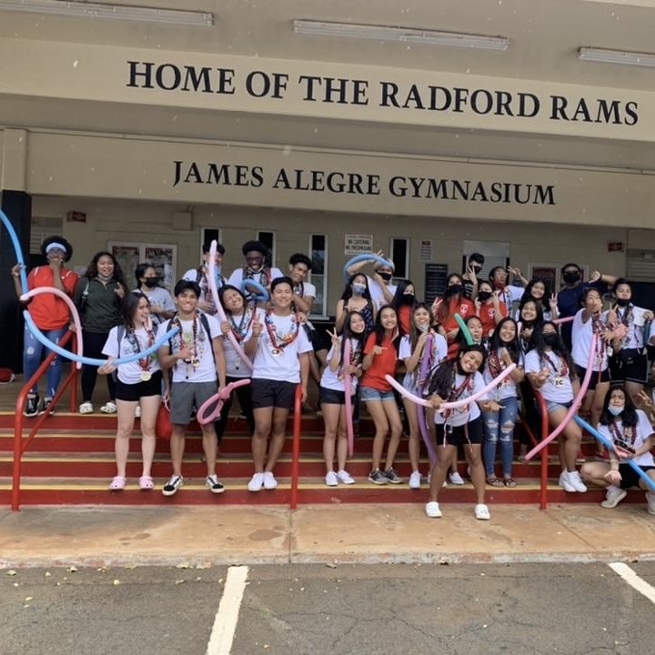

  

In high school, I was part of the Advencement Via Individual Determination (AVID) program which strives to prepare students of all ages for college and beyond. After graduating, I was offered to come back and become a tutor for the program, both at the high school and middle school within my district. There, I monitored weekly tutorials and study groups. At the high school, I assisted juniors and seniors with the college application process and answered any questions that they had. At the middle school level, I have tutored entire classes of various subjects. Also, if needed, I conduct one on one study sessions with students that are struggling in certain subject areas. 

There are many skills that I have gained from AVID tutoring. It is essential to be an articulate communicator. There are many students who can’t grasp certain concepts during lecture, so as their tutor, it’s my job to re-explain the material in a way that is easier for them to understand. I have also learned the importance of forming good relationships with people. For some students, I have become a mentor and someone they look up to. I have come to realize that some students face many obstacles that go beyond school, so having someone that they can trust could make a big difference in their lives. 

