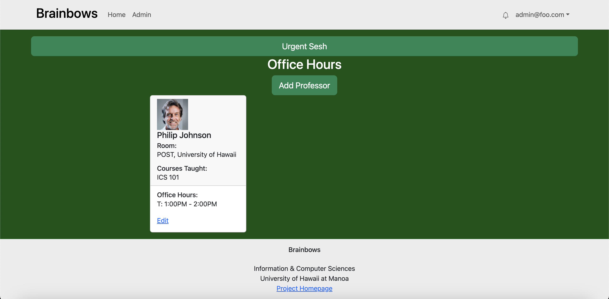

  

Brainbows is an application catered toward University of Hawaii students in the ICS program. Its main goal is to encourage connecting with other ICS students to seek help from one another in any topic relating to computer science. Many CS majors find it hard to connect and find friends with similar interests. Others may find it hard to seek help in their classes when needed and as a result, students tend to lack motivation and fall behind. This application solves both of those problems. By creating a Branbows profile, students have the ability to find a study buddy based on the specific topics they need help with. To encourage both the use of our application and seeking help from others, there is a point system in place, that every time you create a study session with someone, a user earns points. The students with the most points will be shown on a leaderboard. Our application not only allows users to seek help from others, but it also allows users to become mentors (students who are experts in certain classes) to help other students study. 

I worked with 4 other students and we all worked on different pages that are important for the application. I worked on the office hours page. Though students are encouraged to seek out help from fellow students in ICS, we realize that there are some topics that need an extra level of expertise. This is where the office hours page becomes a vital part of the site. Students can view the professors within the ICS department and see which classes and topics they have expertise in. Users can also view their office hours so they know which instructors are available to help. 

This was definitely the most difficult but rewarding project I have ever been a part of. At the end of the day, I am happy to have developed valuable software engineering skills that are needed for future classes and careers in the field of computer science. 
