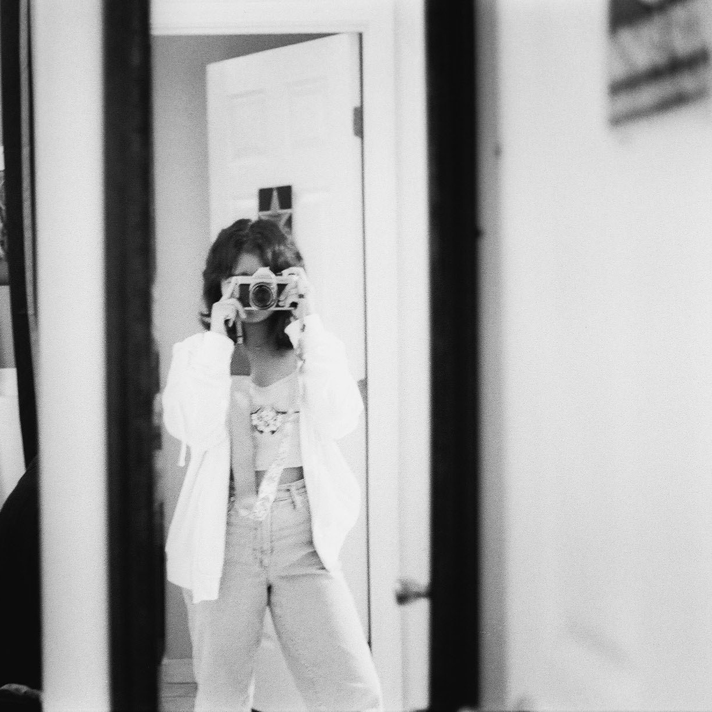

 

The goal of this photography project was to capture the natural beauty of women and femininity. In a way, this series largely criticizes patriarchal society. With so many expectations placed on women, many being problematic, unhealthy, and unattainable beauty and societal standards, I wanted to show that women were already beautiful to begin with. To add on, the patriarchy largely looks down upon femininity, whether it’s seen in either women or men. This is because many people consider feminine traits to be inferior to masculine ones. This project is meant to celebrate feminine energy and convince anyone who views the series to not shy away from their feminine side and instead embrace it. 

This was an individual final project, with the guidance of my professor. I was required to take the photographic techniques I learned throughout the semester and create a series of photos that are meaningful and represent who I am. All photos were taken by me. Since I worked with friends and family, I was responsible making sure that they were comfortable with me taking their photos and ensured they were comfortable enough to pose naturally. I also developed and printed each photo myself in a darkroom provided by the University of Hawaii. 

This was a passion project that I created for an art class. Though this wasn’t a computer science related project, I still gained skills that I can use in my studies and any job I may have in the tech industry. This project taught me how to problem solve. I originally had a completely different theme in mind, but as I developed my photos, none would have fit into the theme I was going for. So instead, I took what I had and created a new theme that was meaningful to me. It also taught me to pay attention to detail. Wrong exposure settings and film type, can ruin an entire photo, and because it’s film, you can't delete the images you already took and try again.
