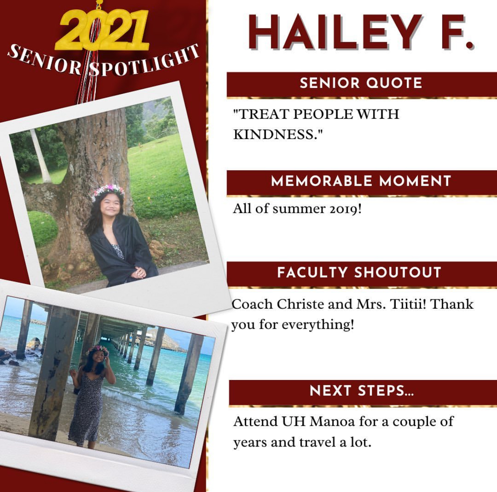

  

I was unlucky enough to have my entire senior year of high school be moved online because of COVID-19. All activities and social events were canceled for the entire year. Two hundred seniors were forced to spend the majority of their last year in high school isolated in their homes and school spirit was at an all time low. As a member of the senior leadership team, it was disappointing to see that events that we had planned out would never be executed. But we still wanted to make the most out of a difficult situation. We were now faced with the challenge of creating a memorable senior year without face to face activities. We naturally turned to social media platforms like Instagram and TikTok, not only to keep in touch with the senior class but also to keep the senior class’ school spirit alive and active. 

I, and two other leadership students were in charge of running the class social media platforms as well as brainstorming virtual activities that students can participate in through their accounts. We wanted to make the activities as engaging as possible. An activity we came up with early on was a “Day in My Life” submission where a student would make use of TikTok to showcase what a normal day looks like for them. As we neared the end of the year, we came up with another activity that showcased everyone’s plans after graduation and their favorite memory from high school. It was my job to manage the Instagram account, repost and manage the submissions from students. As a member of the social media committee, I have also made a couple videos that were posted on our Instagram account as a way to engage with students. For one of the videos, I discussed productive ways to spend time at home during the pandemic. 

This year-long project required leadership skills that I had to learn along the way. Communication was important, especially because my social media committee never met in person. It was important to us that we met virtually every week, discussing ways we could provide engaging virtual activities for the senior class. As a result, I also learned important collaboration skills and working on a team is. This was a project that I would have not been able to do alone. The experience also taught me problem solving skills. As a team, we were faced with a challenge that none of us had experienced before. We had to get creative and think outside the box to ensure that this would be a year that we would never forget. 

